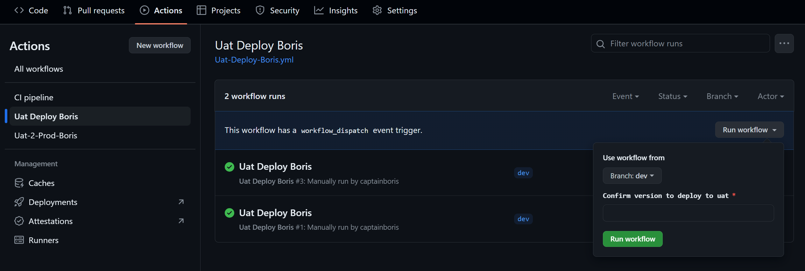

# Platform Api

Platform Api is a GraphQL-based server-side application that interacts with a PostgreSQL database. This project is set up using Node.js and can be utilized as a starting point for building robust backend services.

## Environment setup

Before you begin, make sure you have Node.js(v20.10) and Yarn package manager installed on your machine. You will also need PostgreSQL installed and running locally.

Follow these steps to set up your environment:

### Database Setup

1. Set up your local PostgreSQL database.
2. Ensure that PostgreSQL is running on port `5432` (or update the `.env` file with your custom port).

### Application Setup

1. Clone this repository to your local machine.
2. Navigate to the project root directory in your terminal.
3. Run `yarn` to install all the necessary dependencies.
4. Create a `.env` file in the root directory and add the following environment variables:

```sh
DB_HOST=localhost
DB_NAME=bqCore
DB_PORT=5432
DB_USERNAME=postgres
DB_PASSWORD=CORE_ADMIN
JWT_SECRET=hello_beeQuant
DEFAULT_REFERENCE=COREINTERNAL
DEFAULT_DISPLAY_NAME='New User'
```

Make sure to replace `CORE_ADMIN` with the actual password for your local PostgreSQL instance.

### Start Developing Work

Once the environment setup is complete, you can start the development server:

Run `yarn start` for a production server or `yarn start:dev` for a development server.
Navigate to `http://localhost:3000/graphql` in your web browser to test queries and mutations using the interactive GraphQL playground.

### Test

The project comes with pre-configured unit and end-to-end (e2e) tests. To run these tests and check code coverage, use the following commands:

```bash
# unit tests
$ yarn run test

# test coverage
$ yarn run test:cov
```

These tests are essential for ensuring your application runs correctly before deployment.

## Running public queries

Navigate to web app: http://localhost:5173/, to create(register) users
Make sure the project is running at: http://localhost:3000/graphql
Running an example query like:

```
query GetUsers {
  getUsers {
    id
    email
  }
}
```

## To run a PostgreSQL database locally:

1. Install docker locally:https://www.docker.com/get-started
2. Pull the PostgreSQL Image:
   ```
   docker pull postgres
   ```
3. Run a PostgreSQL Container:

   ```
   docker run --name bqCore -e POSTGRES_PASSWORD=CORE_ADMIN -e POSTGRES_DB=bqCore -p 5432:5432 -d postgres
   ```

4. Wait for the Container to Start and check the container's status:

   ```
   docker ps
   ```

5. Download a DBeaver: https://dbeaver.io/download/, connect your db using DBeaver by using the following config:

   ```
   Host: localhost
   Port: 5432
   Database: bqCore
   Username: postgres
   Password: CORE_ADMIN
   ```

6. (optional) Stop and remove the container: (you need to run step 3 again once you remove it):
   ```
   docker stop bqCore
   docker rm bqCore
   ```

## To run the backend within the docker container:(optional)

Follow these steps to get the backend up and running inside a Docker container.

1. Pre-request:
   create docker network:

   ```
   docker network create platform_api
   ```

   Ensure the PostgreSQL docker container is running properly.
   follow the commands to run postgres container:

   ```
   docker run --name bqCore  --network platform_api -e POSTGRES_PASSWORD=CORE_ADMIN -e POSTGRES_DB=bqCore -p 5432:5432 -d postgres
   ```

2. build docker image:
   Run the following command to build the Docker image for the platform API:

   ```
   docker build -t platform_api .
   ```

3. run docker
   Execute this command to run the Docker container in the background:

   ```
   docker run --name platform_api --network platform_api -e DB_HOST=bqCore -e DB_PORT=5432 -e DB_NAME=bqCore -e DB_USERNAME=postgres -e DB_PASSWORD=CORE_ADMIN -e JWT_SECRET=hello_beeQuant -p 3000:3000 -d platform_api
   ```

4. Navigate to `http://localhost:3000/graphql` in your web browser to test queries and mutations using the interactive GraphQL playground.

## To run the backend with docker-compose:(optional)

This step will show you how to run backend application and the postgreSQL database in a docker network with a simple docker compose up.

Remember, to successfully run the docker compose up command you will need to make sure your postgres container created by the last step is stopped,

```
docker stop bqCore
```

and there are no other processes using localhost:5432. Alternatively you can change the port mapping though this wouldn't be recommended.

Follow these steps to get the backend up and running inside a Docker container.

1. build backend docker container:

   ```
   docker compose build
   ```

2. docker compose up:

   as easy as:

   ```
   docker compose up
   ```

   However, if you made any changes to your source code and you want to run the containers again then please make sure you run the "docker compose build" again. Otherwise your docker will decide to reuse the existing docker image which obviously won't have your latest changes.

3. Navigate to `http://localhost:3000/graphql` in your web browser to test queries and mutations using the interactive GraphQL playground.
4. To temporarily stop the services, just simply run:
   ```
   docker compose stop        # this won't delete any containers
   ```
   and resume with:
   ```
   docker compose start
   ```
   To completely shut down, run:
   ```
   docker compose down        # this will delete both containers
   ```

## To deploy or update the backend to uat environment:(optional, BorisM version)

This step will show you how to deploy the backend application to BorisM's cloud environment (approval from Chris and Boris required).

The complete deployment involves operations in 2 different repos: platform_api and terraform_BorisM.
The CD workflow in platform_api will only build docker image and push the image to aws ecr, you will need to go to the terraform repo to manually trigger the execution of terraform configurations.

1. Go to Actions

   In Actions page, you will see there are 3 pipelines: "CI pipeline", "uat deploy Boris" and "uat to Prod Boris".

2. Go to workflow - Uat Deploy Boris

   In this workflow, you should see there is a manual trigger, which will need you to put in software version number, remember this number because you will need it to double confirm in the terraform repo.
   

3. Run the Uat Deploy Workflow

   You don't need to run the CI workflow again because the deploy workflow will automatically do this for you.

4. Go to terraform_BorisM repository - Actions

   This repo contains the aws cloud infrastructure as code targeting to Boris' aws cloud account. You will see that there is only 1 workflow which is manually triggered as well. This workflow requires you type in environment (uat or prod, case sensitive) and version number.
   Once you put in the correct environment and version number, run the workflow. This will trigger the terraform configuration and the new version of application will be deploy or updated to aws cloud.
   

## **CI/CD**

The CI/CD pipeline for platform_api is divided into three main parts:

1. Pre-commit checks
2. Continuous Integration (CI)
3. Continuous Deployment (CD)

Through these steps, every code update is automatically deployed to the development environment and made ready for testing.

### **1. pre-commit checks:**

Pre-commit checks are triggered every time a local development task is completed and the code is committed via the command: `git commit`. This job includes code formatting and linting. In this repository, Prettier is used for code formatting, while ESLint is used for linting. Husky and lint-staged are utilized to apply code formatting and linting to files that are staged in Git (via the git add command).
Useful reference: https://prettier.io/docs/en/comparison

> #### **A. Formating workflow(prettier)**
>
> 1. When a user runs a commit in the repository with git commit -m "XXX", Husky, a Git hook tool, is triggered.
> 2. Husky then executes the `yarn lint-staged` command, which configured in .husky/pre-commit:
>
>    ```
>    #!/bin/sh
>    . "$(dirname "$0")/_/husky.sh"
>
>    yarn lint-staged
>    ```
>
> 3. The `yarn lint-staged command`, as defined in package.json, targets all .ts, and .tsx files in staged file list(the file list that to be commited via the `git add` command) for Prettier checking using `./prettier/prettier-format.sh`
>    ```
>    "lint-staged": {
>       "src/**/*.{ts,tsx}": "./prettier/prettier-format.sh",
>       "test/**/*.{ts,tsx}": "./prettier/prettier-format.sh"
>    }
>    ```
> 4. The `prettier-format.sh` script runs ` yarn prettier --write` commands to fix the format based on the config file: `./prettier/.prettierrc`.
>    It also adds files that have been formatted to the current day’s git commit using the git add command.

> #### **B. code lint**
>
> plan to use eslint as the code lint tool. and add code lint into the 'lint-staged', in order to completed the pre-commit checking.
> Actually, Need to more investigation on eslint. not quite familar with code lint in typescript.
> To-Be-Continues...

### **2. Continuous Integration (CI) - To be continue**

This section does not contain actual code, but rather my personal thoughts and plans: The Continuous Integration process is composed of three main parts, which I plan to assemble within a single pipeline. If there are additional tests required in the future, we may consider using multiple pipelines to accommodate them.

> #### **A. pipeline env-configuration**
>
> GitHub Actions runners require an OS environment to run the pipeline. I am considering using ubuntu-latest with Node.js (v20.10) installed.
> Optionally, a Docker image could be considered to ensure consistency in the OS and software versions across development, testing, production, and the pipeline runner.
> However, this might lead to a decrease in pipeline execution speed (this needs to be tested to confirm)

> #### **B. yarn install dependencies**
>
> Run yarn to install all dependencies as specified in the dependencies block of package.json.
> (Question: When does it install devDependencies, and when does Yarn refer to the dependencies block in package.json to install the listed dependencies?)

> #### **C. unit test**
>
> So far, unit test is enough for testing stage. `yarn test`

> #### **C. build code**
>
> code build using `yarn build`

### **3. Continuous Deployment (CD)**

This section does not contain actual code, but rather my personal thoughts and plans: The Continuous Deployement process is composed of three main parts, which I plan to assemble within a single pipeline. If there are additional stages required in the future, we may consider using multiple pipelines to accommodate them.

> #### **A. create docker image**
>
> Once the CI step is successful, dockerize the repository to create a Docker image.

> #### **B. push to ECR with gitcommit ID as a image tag**
>
> Push docker image into DEV ECR with tag.
> Consider to use the git commit as a alternative tag for each image.

> #### **C. Update ECS task definition with new image. **
>
> Update ECS Task definition(TD) to deploy the image to ECS.
